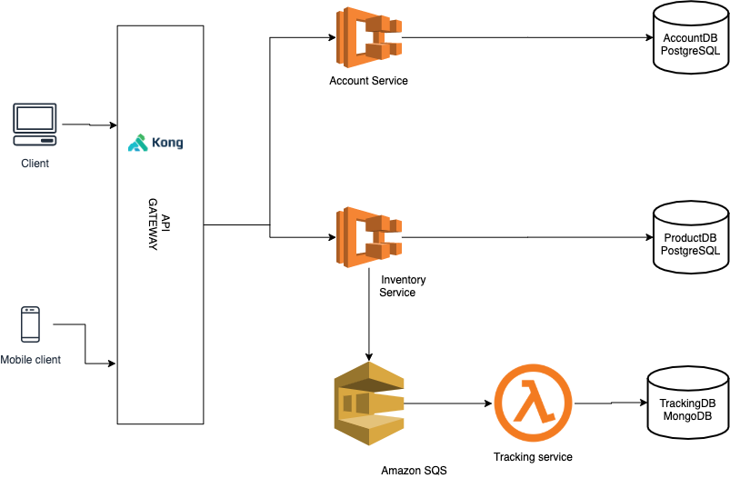
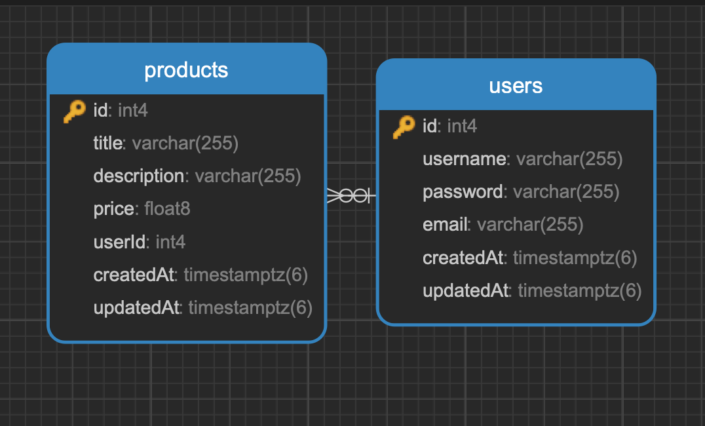

# iCommerce Project
## Use Case
   
   The sample application has two API services namely inventory-service and tracking-service. Each of the service has its own database PostgreSQL (inventory-service) and mongoDB (tracking-service) respectively. 
   These are the repos of two services: 
    <ol>
        <li>
            Inventory
            https://github.com/anhdn/inventory-service
        </li>
        <li>Tracking
            https://github.com/anhdn/tracking-service
        </li>
    </ol>
    
## Architecture


In this architecture, using Microservices Architecture on AWS.

## Inventory service

This service is responsible for managing products built in Express GraphQL API with JWT Authentication and support for sqlite, mysql, and postgresql
Using Amazon Simple Queue Service (SQS) to decouple and scale microservices, distributed systems, and serverless applications.

### Getting started

This guide helps you set up this repo on development and run test.  

Stack:
- Support GraphQL API And REST API
- Authentication via JWT
- Support for SQLite, MySQL, and PostgreSQL
- Environments for `development`, `testing`, and `production`
- Linting USing Eslint 
- Integration tests running with Jest

## InventoryDB Diagram



## Folder Structure
```
.
├── api
├── config
├── database.env
├── docker-compose.yml
├── node_modules
├── package-lock.json
├── package.json
├── scripts
└── test
```
Main directories:

- api - for controllers, queries, mutations, models, types, services, etc.
- config - for routes, database, etc.
- db - this is only a directory for the sqlite database, the default for `NODE_ENV=development`
- test - using [Jest](https://github.com/facebook/jest)

### Event Tracking uses AWS SQS 
Checkout ```/api/services/tracking.sqs.service```

## Install and Use
```sh
# start docker compose install postgresql database
$ docker-compose up -d
# cd into project root and install dependencies
$ npm install 
# Run app 
$ npm start 
```

## Run tests
```
# Run unit tests 
$ npm run test
# only runs tests for using with ci tools 
$ npm run test-ci
```
 
### other commands

- `npm run dev` - for development
- `npm run lint` - linting with eslint
- `pretest` - runs linting before `npm test`
- `test-ci` - only runs tests, nothing in pretest, nothing in posttest, for better use with ci tools

### Postman API collection

https://www.getpostman.com/collections/11005016854d0f3134cd


## Tracking Service
https://github.com/anhdn/tracking-service


## LICENSE
MIT © Anh Dang
