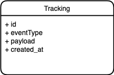
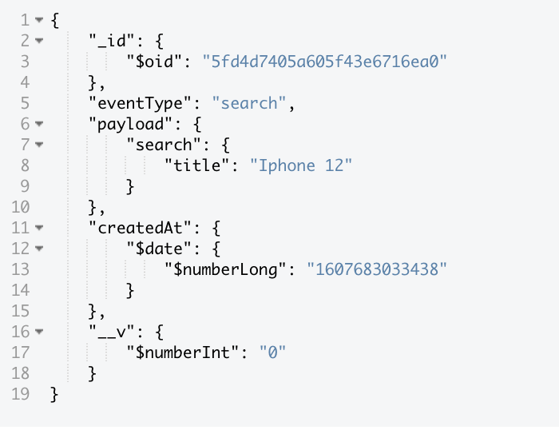

# Inventory Service (iCommerce Project)

https://github.com/anhdn/inventory-service

An API for managing products built in Express GraphQL API with JWT Authentication and support for sqlite, mysql, and postgresql
Using Amazon Simple Queue Service (SQS) to decouple and scale microservices, distributed systems, and serverless applications.


## Getting started

This guide helps you set up this repo on development and run test.  

Stack:
- Support GraphQL API And REST API
- Authentication via JWT
- Support for SQLite, MySQL, and PostgreSQL
- Environments for `development`, `testing`, and `production`
- Linting USing Eslint 
- Integration tests running with Jest

## Microservice architecture


In this architecture We use Microservices Architecture on AWS. Apply Design patterns of the Twelve-Factor App are leveraged for microservices.

## ProductDB Diagram


## TrackingDB Diagram


Tracking collection data sample



## Folder Structure
```
.
├── api
├── config
├── database.env
├── docker-compose.yml
├── node_modules
├── package-lock.json
├── package.json
├── scripts
└── test
```
Main directories:

- api - for controllers, queries, mutations, models, types, services, etc.
- config - for routes, database, etc.
- db - this is only a directory for the sqlite database, the default for `NODE_ENV=development`
- test - using [Jest](https://github.com/facebook/jest)
- sevices

### Event Tracking uses AWS SQS 
Checkout ```/api/services/tracking.sqs.service```

## Install and Use
```sh
# start docker compose install postgresql database
$ docker-compose up -d
# cd into project root and install dependencies
$ npm install 
# Run app 
$ npm start 
```

## Tracking Service

https://github.com/anhdn/tracking-service

### Setup

```
npm install
serverless deploy
```

## Usage
In `handler.js` update the `mongoString` with your mongoDB url.
 
### other commands

- `npm run dev` - for development
- `npm run lint` - linting with eslint
- `pretest` - runs linting before `npm test`
- `test-ci` - only runs tests, nothing in pretest, nothing in posttest, for better use with ci tools

### Postman API collection

https://www.getpostman.com/collections/11005016854d0f3134cd


## LICENSE

MIT © Anh Dang
